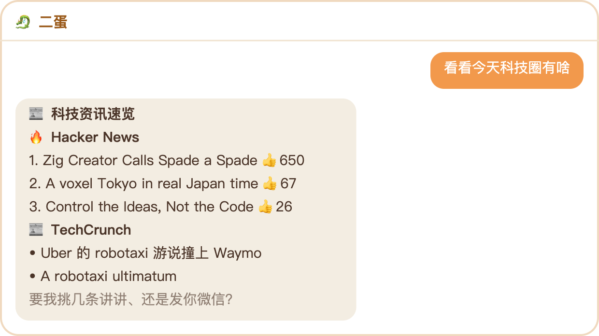
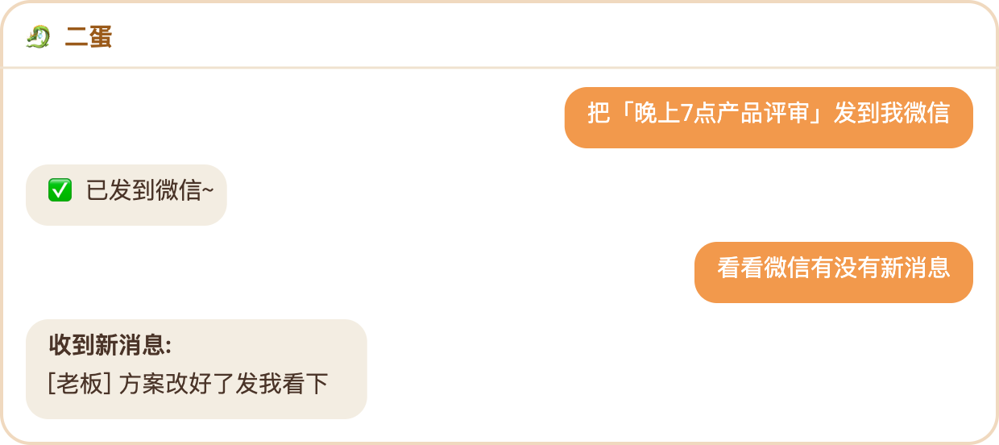

# PetAssistant 🐉

**[中文](README.md) · [English](README.en.md)**

> A little dragon that lives on your desktop — it **listens, remembers, organizes and reminds**. Toss it anything (tasks, ideas, done-reports, chit-chat) and it files your tasks, writes a daily log, and pings you on time. It can also read images and files, and remember what you told it. It doesn't write code or do heavy lifting.

<p align="center">
  
</p>

**🎨 Themes**


**🐲 Swappable horns**


## Features
- **Desktop pet**: paces along the screen edge, idle gestures, theme recoloring, swappable dragon horns; slide your cursor onto it and it stops to ask "what's up?", and it arcs over a resting cursor in its path
- **Chat brain**: plug in your own LLM (OpenAI / Anthropic API format), with multi-turn context; replies render as Markdown
- **Memory**: local vector memory (bilingual CN/EN, hybrid semantic + keyword search) that learns you over time
- **File analysis**: documents (pdf / word / txt / code / logs) and images (screenshots) via 📎 picker / drag-drop / Cmd+V paste
- **Skill mounting**: Claude Agent Skills format (`SKILL.md`) — drop a skill folder into `skills/` and restart; standard skills from Claude or the web work directly
- **Reminders**: fire on schedule (can push to Matrx groups, etc.)

## First-time setup
```bash
cd ~/Desktop/PetAssistant/pet-app

# 1) Python env for vector memory (local, no torch, ~210MB)
python3 -m venv mem/.venv
mem/.venv/bin/pip install -r mem/requirements.txt

# 2) Launch (first run seeds pet-config.json / pet-data from .example files and builds the app)
./start_pet.sh
```
Then open the dragon → ⚙️ Settings:
1. **Configure a model**: your LLM endpoint (URL / model ID / API key). It works without one too — messages are logged to the inbox first.
2. **Name it**: give it a name under "🐣 名字 (Name)".
3. (Optional) pick a theme color and horn style.
4. (Optional) branch reports: list the GitLab repos to track in `skills/branch-report/data/repos.txt`.

> You can also drive it from a Claude Code session in this folder (`cd ~/Desktop/PetAssistant && claude`).

## Built-in skills & usage

Skills live in `skills/`, aligned with [Claude Agent Skills](https://docs.claude.com/en/docs/claude-code/skills) (one `SKILL.md` per folder). Keep the ones you want, delete the folders you don't; standard skills from Claude or the web work when dropped in and restarted.

### 📰 Tech news (tech-news)
Say "show me today's tech news" and it fetches **Hacker News** + the **RSS feeds** you list in `skills/tech-news/sources.txt`, then formats a digest (fully local, no API key):



### 💬 WeChat send/receive (wechat, bidirectional)
Built on WeChat's iLink Bot protocol — sends and receives. Log in **once via QR** in the terminal (use a secondary account; this is an unofficial channel with ban risk):
```bash
cd ~/Desktop/PetAssistant
echo '{"action":"login"}' | python3 skills/wechat/run.py   # open the printed link, scan with WeChat
```
Credentials are saved to `skills/wechat/wechat.conf` (git-ignored). Then the pet can send/receive WeChat messages:



> Receiving is currently pull-once (`action=receive`); a resident auto-listener is on the roadmap.

## Layout
| Path | Purpose |
|------|---------|
| `pet-app/` | The pet app (Swift + WebView): `Sources/` brain, `web/` UI & animation, `mem/` vector memory |
| `pet-data/` | Its memory (**your private data, git-ignored**): `inbox.md`, `tasks.md`, `about-you.md`, `daily/` |
| `skills/` | Extensible skills: branch report, group messaging, tech-news aggregation, WeChat send/receive, etc. (Claude Agent Skills format — one `SKILL.md` per folder, drop in & restart) |
| `CLAUDE.md` | Persona & behavior rules |
| `docs/` | Design docs & project map |
| `*.example.*` | Seed/example files; your local files are generated from these on first run |

## Privacy
Real data (`pet-data/*.md`, `pet-config.json`, `repos.txt`, chat log, vector index, venv) is all `.gitignore`d and **never committed**. `pet-data/` holds all of its memory — back it up to your own private location.
